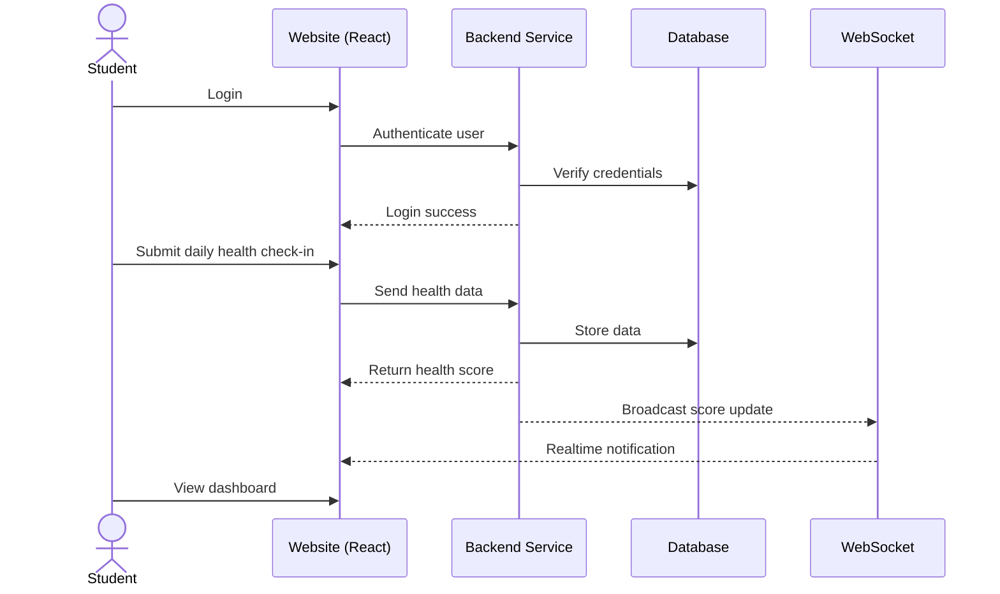

# Student MindBody Score

[My Notes](notes.md)

College life had been hard for me and many others on both mind and body. Students are constantly exposed to high pressure; lack enough exercises; experience loneliness and hopelessness. Those may cause us to suffer severe physical and mental issues while we can’t recognize them. Many factors such as inconsistency in sleeps, stress spikes, focus drops and social issues alone may not necessarily indicate health crisis; a combination of them can cause serious problems among students.

I want to build a health scoring web app that tracks both physical and mental inputs through quick daily check-ins specifically for College students. This project will be built iteratively throughout this semester as we learn new technologies. Each time we add a new requirement (React routing, service endpoints, authentication, database persistence, WebSocket updates, and third-party APIs), I will expand the application to include that capability in a meaningful way.

## 🚀 Specification Deliverable

A student-focused health tracking platform that turns daily physical and mental check-ins into a clear, easy-to-understand health score and progress dashboard.

For this deliverable I did the following. I checked the box `[x]` and added a description for things I completed.

- [x] Proper use of Markdown - Used headings, lists, images, links, code blocks, and mermaid diagrams.
- [x] A concise and compelling elevator pitch - Added a student-focused, problem-driven pitch.
- [x] Description of key features - Listed core user-facing features of the system.
- [x] Description of how you will use each technology - Mapped all required technologies to specific usage.
- [x] One or more rough sketches of your application. Images must be embedded in this file using Markdown image references. - Included a UI sketch image and a sequence diagram.

### Elevator pitch

Most college students ignore their health until something goes seriously wrong. Constant pressure, poor sleep, lack of exercise, stress, and social isolation often pile up, and it’s the combination that quietly causes real damage. This app makes both physical and mental health visible through simple daily check-ins and an easy-to-understand score. Instead of guessing, students can see trends, understand what affects them most, and make small changes before problems become severe.

### Design

Here is a sequence diagram that shows how we collect data, analyze data and provide user with scores and recommendations.

### Key Features

- User authentication system (register, login, logout) to keep personal health data private
- Daily health check-in form for physical and mental factors (sleep, exercise, stress, focus, mood, etc.)
- Automatic health score calculation with separate Physical and Mental sub-scores
- Personal dashboard showing current score, breakdown, and contributing factors
- History and trend visualization to track changes over time
- Realtime notifications when a new check-in is recorded or a score is updated (via WebSocket)
- Daily health tip or motivation content powered by a third-party API

### Technologies

I am going to use the required technologies in the following ways.

- **HTML**  Use semantic HTML to structure the application (header, navigation, main content, footer). Forms will be used for login/registration and daily health check-ins with proper labels and accessible inputs.
- **CSS**  Style the application to be responsive on both mobile and desktop devices. Use consistent spacing, typography, and color contrast for readability. CSS transitions and animations will provide visual feedback for form validation, score updates, and notifications.
- **React**  Build the frontend as a single-page application with component-based architecture. Components will include login/register forms, daily check-in form, score display cards, dashboard, and history view. React routing will control which view is displayed based on user actions and authentication state.
- **Service (Backend)**  Implement a Node.js/Express backend that provides multiple endpoints for:
  - User authentication (register, login, logout)
  - Submitting and retrieving health check-in data
  - Retrieving calculated health scores and insights  
  The service will also call at least one third-party API (such as a daily health tip or motivational quote API) and return processed results to the frontend.
- **Database / Login**  Store user accounts securely in the database along with timestamped health check-in records. Health scores and historical data will be retrieved from the database and rendered in the user dashboard.
- **WebSocket**  Establish a WebSocket connection after user login to deliver realtime updates, such as when a new check-in is recorded or when the health score is recalculated. These updates will be displayed in the UI as live notifications or activity indicators without refreshing the page.

## 🚀 AWS deliverable

For this deliverable I did the following. I checked the box `[x]` and added a description for things I completed.

- [x] **Server deployed and accessible with custom domain name** - [My server link](https://doxys.click).

## 🚀 HTML deliverable

For this deliverable I did the following. I checked the box `[x]` and added a description for things I completed.

- [x] **HTML pages** - Created 4 HTML pages: `index.html`, `login.html`, `dashboard.html`, and `about.html` to represent the main components of the application.
- [x] **Proper HTML element usage** - Used semantic structure including `header`, `nav`, `main`, `section`, and `footer` on each page.
- [x] **Links** - Added navigation links between all pages (Home/Login/Dashboard/About) so the app can be explored end-to-end.
- [x] **Text** - Added descriptive content explaining the app purpose, planned features, and what each page represents.
- [x] **3rd party API placeholder** - Included a “Daily wellness tip” placeholder section (to be populated later via a third-party API).
- [x] **Images** - Included an image placeholder (e.g., app preview image) on the home page.
- [x] **Login placeholder** - Implemented login/register form placeholders and a “current user” display placeholder.
- [x] **DB data placeholder** - Added a community/high-scores style table placeholder to represent data that will be stored and loaded from the database.
- [x] **WebSocket placeholder** - Added a live updates/activity feed placeholder to represent real-time updates received from WebSocket.

## 🚀 CSS deliverable

For this deliverable I did the following. I checked the box `[x]` and added a description for things I completed.

- [x] **Visually appealing colors and layout. No overflowing elements.** - Applied a consistent color scheme, spacing, and layout across all pages. Verified that content remains readable and does not overflow on different screen sizes.
- [x] **Use of a CSS framework** - Integrated the Bootstrap CSS framework via CDN and used it meaningfully for layout containers, navigation buttons, form controls, and tables.
- [x] **All visual elements styled using CSS** - All visible elements including navigation, forms, tables, images, and page layout are styled using a combination of custom CSS and Bootstrap utility classes.
- [x] **Responsive to window resizing using flexbox and/or grid display** - Used Flexbox utilities from Bootstrap and custom CSS grid/flex rules to ensure the layout adapts properly to different screen widths, especially on the dashboard page.
- [x] **Use of a imported font** - Imported a custom font using Google Fonts and applied it globally through CSS.
- [x] **Use of different types of selectors including element, class, ID, and pseudo selectors** - Used element selectors (e.g. body, main), class selectors for layout and components, ID selectors for form elements, and pseudo selectors such as hover and focus.

## 🚀 React part 1: Routing deliverable

For this deliverable I did the following. I checked the box `[x]` and added a description for things I completed.

- [ ] **Bundled using Vite** - I did not complete this part of the deliverable.
- [ ] **Components** - I did not complete this part of the deliverable.
- [ ] **Router** - I did not complete this part of the deliverable.

## 🚀 React part 2: Reactivity deliverable

For this deliverable I did the following. I checked the box `[x]` and added a description for things I completed.

- [ ] **All functionality implemented or mocked out** - I did not complete this part of the deliverable.
- [ ] **Hooks** - I did not complete this part of the deliverable.

## 🚀 Service deliverable

For this deliverable I did the following. I checked the box `[x]` and added a description for things I completed.

- [ ] **Node.js/Express HTTP service** - I did not complete this part of the deliverable.
- [ ] **Static middleware for frontend** - I did not complete this part of the deliverable.
- [ ] **Calls to third party endpoints** - I did not complete this part of the deliverable.
- [ ] **Backend service endpoints** - I did not complete this part of the deliverable.
- [ ] **Frontend calls service endpoints** - I did not complete this part of the deliverable.
- [ ] **Supports registration, login, logout, and restricted endpoint** - I did not complete this part of the deliverable.

## 🚀 DB deliverable

For this deliverable I did the following. I checked the box `[x]` and added a description for things I completed.

- [ ] **Stores data in MongoDB** - I did not complete this part of the deliverable.
- [ ] **Stores credentials in MongoDB** - I did not complete this part of the deliverable.

## 🚀 WebSocket deliverable

For this deliverable I did the following. I checked the box `[x]` and added a description for things I completed.

- [ ] **Backend listens for WebSocket connection** - I did not complete this part of the deliverable.
- [ ] **Frontend makes WebSocket connection** - I did not complete this part of the deliverable.
- [ ] **Data sent over WebSocket connection** - I did not complete this part of the deliverable.
- [ ] **WebSocket data displayed** - I did not complete this part of the deliverable.
- [ ] **Application is fully functional** - I did not complete this part of the deliverable.
